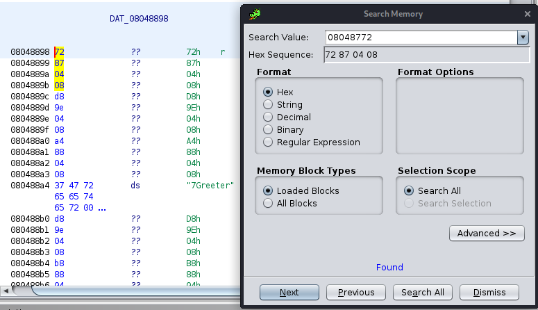

# blow_out_flames

## Initial exploration

As with every pwn challenge, we run `checksec` to see what we're dealing with.

```bash
$ checksec chall          
    Arch:     i386-32-little
    RELRO:    Partial RELRO
    Stack:    No canary found
    NX:       NX enabled
    PIE:      No PIE (0x8048000)
```

That's great we don't have to deal with too many security features.

Running the binary normally looks like this.
```bash
$ ./chall                 
Greetings from Santa! Wanna talk? y
What is your name? Joe 
Hohoho! Hello, Joe!
```

Keep in mind these strings.

---
## Static Analysis

### Finding main
Opening in Ghidra, we see that there are no symbols, so our functions are unlabelled. That's okay, we can slowly analyse them. 

Let's start from `entry`, since that is almost always labelled by Ghidra.

```c
void entry(void)

{
  __libc_start_main(FUNC_1);
  do {
                    /* WARNING: Do nothing block with infinite loop */
  } while( true );
}
```
There's our `main` function! It looks something like this, after relabelling some variables.

```c
bool main(void)

{
  char user_input [64];
  undefined **local_14 [2];
  undefined *local_c;
  
  local_c = &stack0x00000004;
  alarm(0x3c);
  setvbuf(stdout,(char *)0x0,2,0);
  setvbuf(stdin,(char *)0x0,2,0);
  setvbuf(stderr,(char *)0x0,2,0);

  local_14[0] = &PTR_0804888c;
  printf("Greetings from Santa! Wanna talk? ");
  FUNC_1();
  fgets(user_input,0x200,stdin);

  if (user_input[0] == 'y') {
    FUNC_2(local_14);
  }

  return user_input[0] != 'y';
}
```

Looks like a stack overflow problem, since our `user_input` is only defined for 64 characters and we are reading 0x200 characters with `fgets(user_input,0x200,stdin)`. This means that we can overwrite `local_14` and `local_c`.

`local_14` seems to be set to the address of `PTR_0804888c`, so let's see what's there.

```
PTR_0804888c
0804888c 8a 87 04 08     addr       FUNC_3
08048890 00              ??         00h
```

Looks like it's a pointer to another function (in little-endian format).

### Other functions

We then look at `FUNC_1`, `FUNC_2` and `FUNC_3`.

```c
void FUNC_1(void)

{
  return;
}
```

Nothing interesting here. *yawn*

```c
void FUNC_2(code **param_1)

{
  size_t sVar1;
  char user_input2 [109];
  
  printf("What is your name? ");

  fgets(user_input2 + 1,100,stdin);
  sVar1 = strlen(user_input2 + 1);
  user_input2[sVar1] = '\0';

  (**(code **)*param_1)(param_1,user_input2 + 1);
  return;
}
```

Aha, this looks interesting. It looks like it's dereferencing `param_1` twice and executing the code stored there, passing in our "name" as an argument. This means that if we can set `param_1` to be a pointer to a pointer to a function we want to execute, this function will execute it.

```c
void FUNC_3(undefined4 param_1,char *param_2)

{
  printf("Hohoho! Hello, %s!\n",param_2);
  return;
}
```
Remember this string from earlier? So it seems like `FUNC_2` is calling `FUNC_3`. 

---
## Putting it together

Let's review what we have so far. We have a stack overflow vulnerability which allows us to overwrite `local_14`, which should contain a pointer to pointer to a function (`FUNC_3` by default). That function is then executed with our "name" as an argument.

Looking through the other functions, we find something useful.

```c
void FUNC_4(undefined4 param_1,char *param_2)

{
  system(param_2);
  return;
}
```

All we have to do now is to find an address that contains a pointer to this function. In Ghidra's menu, select Search -> Memory and enter the address of this function.


*Screenshot of memory search in Ghidra*

Our magic pointer to a pointer to a function is thus located at 0x08048898.

We then use `pwntools` to interface with the server for us and then get an interactive shell. The full script is found in `solve.py`.

`HTF{bof_1s_v3ry_fun_but_h4rd_th4nk_y0u_h4ck3r}`