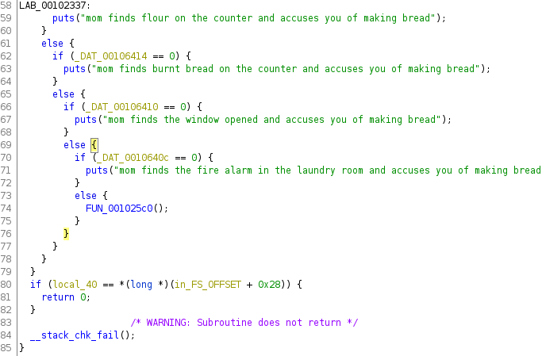

# bread_making

An interesting misc challenge that doesn't require *too* much technical knowledge, just patience.

Opening the binary with ghidra, we see that there are a few checks we need to pass before we reach the function that prints the flag.


*Screenshot of part of the main function*


*Screenshot of the flag function*

We then look at the strings in the binary.

```bash
$ strings bread
...
pull the tray out with a towel
theres no time to waste
pull the tray out
the window is closed
the fire alarm is replaced
you sleep very well
time to go to sleep
close the window
replace the fire alarm
brush teeth and go to bed
...
```

Looks like we found some actions that we can key in, and it's just a matter of finding the order in which to enter the actions.

It is still a useful challenge to build some pwntools skills :)